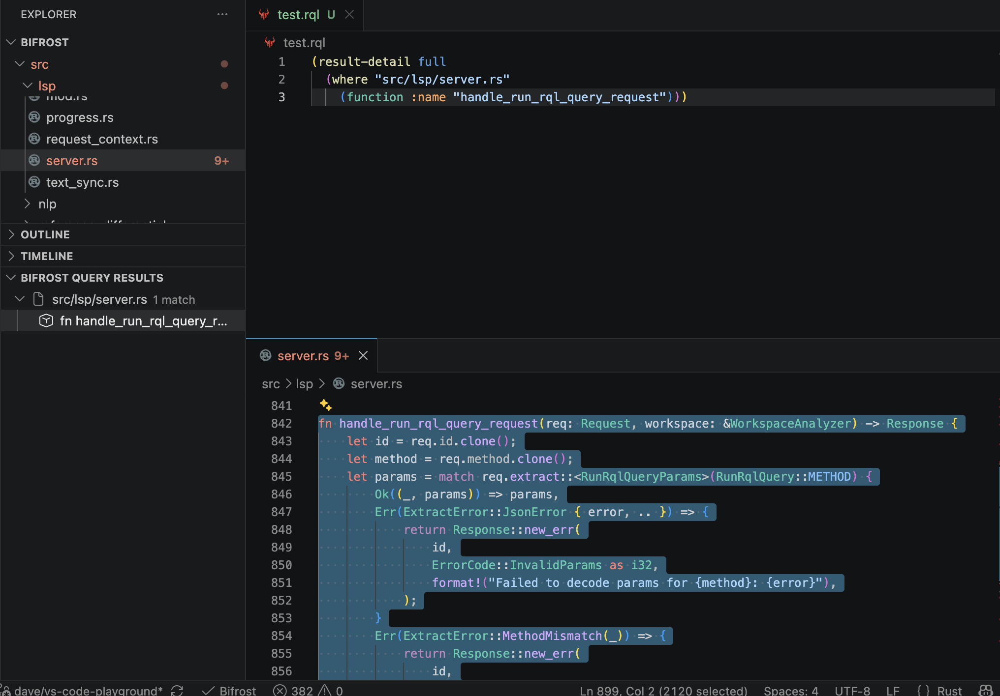

# RQL in VS Code

Write and run Rune Query Language queries and policies in VS Code, and navigate the results.

The Bifrost VS Code extension recognizes `.rql` files as **Bifrost RQL** and
`.rqlp` files as **Bifrost RQL Policy**. RQL, the
[Rune Query Language](https://bifrost.brokk.ai/rune-query-language/), is Bifrost's S-expression
language for structural `query_code` searches.

> [!CAUTION]
> **Most RQL features need the language server**
> Bifrost built after release 0.12.0 does not serve LSP, and the new `bifrost-lsp`
> server v0.1.1 is released. Extension version 0.12.0 downloads and runs it.
> See [LSP Server](./lsp.md) and
> [VS Code LSP](./vscode.md).

## What Needs the Server

| Feature | Needs a running server |
| --- | --- |
| Language association, syntax highlighting, and file icons for `.rql`, `.rqlp`, and `.rune` | No |
| Diagnostics for the current `.rql` or `.rqlp` text, updated 300 ms after you stop typing | Yes |
| Hover for `.rql` and `.rqlp` | Yes |
| **Format Document** for `.rql` and saved `.rune` files | Yes |
| Run a query with the Play button | Yes |
| Run a policy with the Play button | Yes |
| **Suppress finding...** | Yes |
| **Bifrost: Show Rune IR** | Yes |

Opening a query file does not start the server or wait for indexing. Start the
server, wait until indexing finishes, and then run the query. If the server is
not ready, the extension shows a warning and does not run anything.

Write queries in RQL text. The extension does not run JSON query files. To get
the canonical JSON form of a query, use the REPL `:json` command.

## Run a Query

Open a `.rql` file and click the Play button in the editor title. The extension
sends the current editor text, including unsaved edits, to the server.

For example, this query finds the `main` function in `src/bin/bifrost.rs`:

```lisp
(result-detail full
  (where "src/bin/bifrost.rs"
    (function :name "main")))
```

Results appear in the **Bifrost Query Results** view in the Explorer. If a
normal query returns nothing, the extension says so in a notification.

For `(explain QUERY)` and `(profile QUERY)`, the extension writes the report to
**Output > Bifrost**. A profile report includes the complete JSON telemetry.
The profiled query's ordinary results also appear in the results view. Explain
mode only plans the query, so it shows no "no results" message. See
[Explain and Profile CodeQuery](https://bifrost.brokk.ai/code-query-explain-profile/).



The screenshot shows a query against an older Bifrost source tree.

### Query Scope

The query searches every root that the running server has indexed:

- all VS Code workspace folders by default; or
- the directories in `bifrost.roots`, without the paths in `bifrost.exclude`.

The `.rql` file itself can be outside the workspace. Only the code that the
query searches is limited to the indexed roots.

### Results View

**Bifrost Query Results** groups results by file. Select a result to open its
file:

- A result with a source range opens the file and selects that range.
- A file result opens the file at its first line.
- A control edge shows both endpoint IDs and ranges.
- A typestate witness expands into its ordered steps. Each step with a source
  location opens that location.

The view shows each result type that `query_code` returns, including
structural matches, declarations, procedures, program points, control edges,
typestate and taint findings, flow endpoints, occurrences, lexical scopes,
bindings, resolution candidates, and reference edges. Pipeline forms such as
`enclosing-decl`, `typestate`, `occurrences-in`, `binding-of`, `binding-uses`,
`candidates-of`, `edges-of`, and `file-of` return the same row types, so their
results can be opened from the same view. See
[CodeQuery reference](https://bifrost.brokk.ai/reference/code-query/) for the result types and their
fields.

Labels and tooltips show the evidence that each row carries. Some rows need
care when you read them:

- Typestate findings show certainty, protocol, proof and completeness status,
  and witness counts. They do not show a severity.
- The one lexical scope per file that has no AST node is labeled as the
  synthesized whole-file scope.
- A resolution candidate without a recorded precedence tier is labeled
  `unattributed`, not as the weakest tier.
- When a resolution trace is `selection_only`, a missing rejection row tells
  you nothing. The tooltip says so.
- On a reference edge, an `unknown` owner relation is inconclusive, not
  external. A `declaration_site` row is editor navigation, not a runtime use.

## RQL Policy Documents

A `.rqlp` file holds a `(policy ...)` or `(endpoint ...)` document. It is not an
ordinary query. Its Play button runs **Bifrost: Run RQL Policy**, not the query
command, and its results never go to **Bifrost Query Results**. The CLI
`--query-file` option does not accept it.

The extension highlights nested RQL only inside `(rql ...)`. Diagnostics check
only the current text. They do not read endpoint directories, catalogs, or
files that `(rql-file ...)` names. The server resolves those when it runs the
policy.

To run a policy, open the `.rqlp` file and click Play, or run **Bifrost: Run
RQL Policy** from the Command Palette. The extension sends:

- the current editor text, including unsaved edits;
- the file's URI; and
- today's date in UTC as the evaluation date.

The extension does not name a suppression file. An `(endpoint ...)` document
cannot be run. A progress notification lets you cancel the run. Starting a new
run cancels the previous one.

Results appear in **Bifrost Policy Results**. For each policy, the view shows
its completion state and its active findings. Select a finding, or a step of
its display path, to open the source. Suppressed findings do not appear in the
active list. They appear under **Suppression audit**, which also marks
decisions that are expired, orphaned, policy-hash drifted, or whose result was
omitted. If you edit the policy or the workspace while results are shown, the
view marks them stale. **Bifrost: Clear Policy Results** clears the view.

The extension reads policy report schema version 5. It shows an error for any
other version.

When the date or the suppression file must be fixed, run the policy from the
CLI with `--evaluation-date` and `--suppressions-file`. See
[Static-Analysis Policies](https://bifrost.brokk.ai/static-analysis-policies/).

### Suppress a Finding

Right-click a finding in **Bifrost Policy Results** and choose **Bifrost:
Suppress finding...**. The command is available only for a current, active
finding with a strong identity. Keep the policy file that produced the finding
open.

1. Choose where to write the suppression:
   - **Public**: `.bifrost/suppressions.json`, shared with the project.
   - **Private**: `.bifrost/suppressions.private.json`, for decisions you do
     not publish.
   - **Local**: `.bifrost/suppressions.local.json`, for your checkout only.
2. Enter a reason. If you leave it blank, the reason is `unspecified`. If
   `bifrost.requireSuppressionReason` is `true`, a blank reason is an error.
3. The server prepares the edit. The extension creates the file and its
   directory if needed, applies the edit, and saves the file.
4. The extension runs the policy again.

If the suppression file or a related source file changes while the server
prepares the edit, the extension does not write anything. Run the command
again.

## Agents and MCP

These Play actions use the editor's language server. They do not start an MCP
server, and they do not show that an agent can run a query or policy.

- For agent queries, configure a query-capable MCP toolset and pass a saved
  workspace `.rql` file to `query_code` through `query_file`. MCP does not
  accept unsaved editor text or inline RQL.
- For agent policy runs, call the `run_policy` MCP tool with workspace `.rqlp`
  paths and an evaluation date.

See [MCP query and RQL availability](https://bifrost.brokk.ai/mcp/#query-and-rql-availability).

For RQL syntax and the REPL, see [Rune Query Language](https://bifrost.brokk.ai/rune-query-language/).
